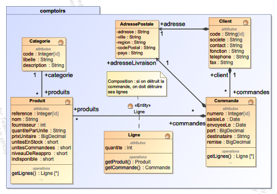
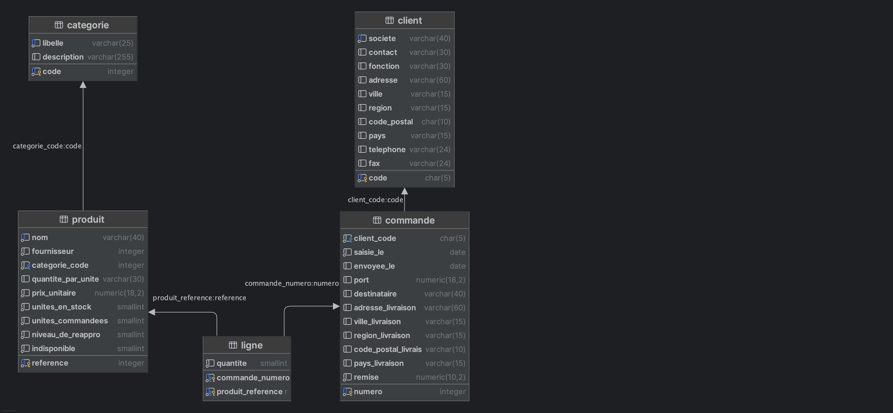
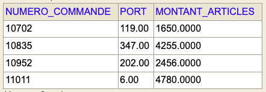

# Les Comptoirs - Spring JPA

## Table des matières
- [Description](#description)
- [Prérequis](#prérequis)
- [Installation](#installation)
- [Exercice](#exercice)

## Description
Ce projet utilise Spring Boot et JPA pour gérer la base de données `comptoirs`. 
Il inclut des exemples d'utilisation de Spring Data JPA (Entités, Repository).

Le modèle conceptuel (UML) de la base de données est illustré en Figure 1 :



*Figure 1 : Modèle conceptuel de la base de données*

JPA Génère automatiquement le modèle logique (relationnel) de la base de données, illustré en Figure 2 :



*Figure 2 : Modèle logique généré par Spring - JPA*

## Prérequis
- Java 21
- Maven

## Installation
Clonez le dépôt et naviguez dans le répertoire du projet :
```bash
git clone https://github.com/bastide/comptoirs-spring-jpa.git
cd comptoirs-spring-jpa
mvn clean spring-boot:run
```
Ouvrir l'application web sur [http://localhost:8989](http://localhost:8989)
## Exercice

En vous appuyant sur les exemples fournis (dans [`ClientRepository`](./src/main/java/comptoirs/dao/ClientRepository.java) et [`ProduitRepository`](./src/main/java/comptoirs/dao/ProduitRepository.java) ), réalisez les tâches suivantes :

1) Dans le repository JPA [`CommandeRepository`](./src/main/java/comptoirs/dao/CommandeRepository.java), ajoutez une méthode qui calcule le montant des articles commandés d'une commande dont 
le numéro est passé en paramètre. Le montant est calculé avec la somme des montants des lignes de commande
(quantité * prix unitaire), en tenant compte de la remise accordée.

```java
/**
 * Calcule le montant des articles commandés dans une commande
 * @param numeroCommande le numéro de la commande à traiter
 * @return le montant des articles commandés, en tenant compte de la remise
 */
    BigDecimal montantArticles(Integer numeroCommande);
```

Vous devrez définir la requête SQL (ou JPQL) qui calcule les résultats. 
Testez cette méthode dans [`ConsoleApp`](./src/main/java/comptoirs/ConsoleApp.java) et en faisant un test unitaire dans [`CommandeRepositoryTest`](./src/test/java/comptoirs/dao/CommandeRepositoryTest.java).

2) Dans le repository JPA [`CommandeRepository`](./src/main/java/comptoirs/dao/CommandeRepository.java), ajoutez une méthode qui renvoie, pour un client dont le code est passé en paramètre, la liste de 
ses commandes avec les informations illustrées en Figure 3.

Vous devrez définir la requête SQL (ou JPQL) qui calcule les résultats et définir une projection pour représenter les résultats de la requête. 
Testez cette méthode dans [`ConsoleApp`](./src/main/java/comptoirs/ConsoleApp.java).



*Figure 2 : Exemple de résultats attendus pour la requête (client ALFKI)*